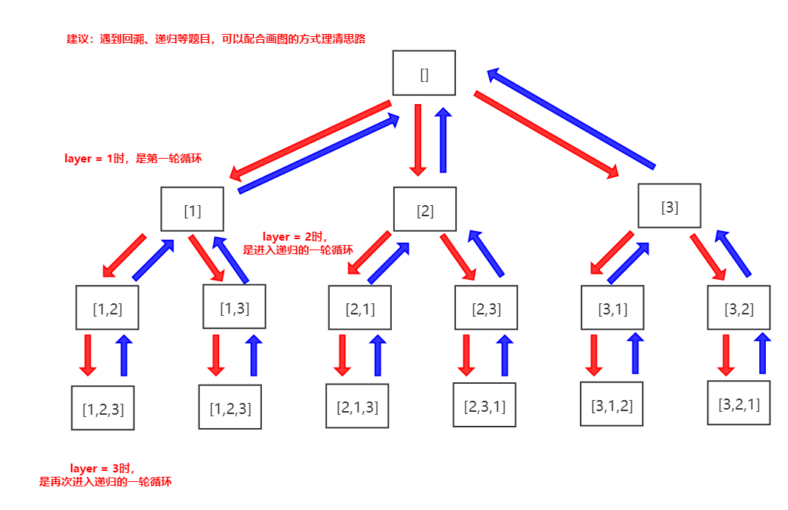
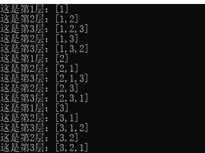

### 题目要求

1. 要求在给定的一个 **没有重复** 数字的序列，返回其所有可能的全排列。

### 图解示例



### 算法思想

使用递归的方法

1. 设计全局变量（也就是返回值），设计存储分步结果的列表，设计一个数组，用来判断该数是否已经在分步结果中
2. 特判，如果传入的是一个空列表，那返回空列表
3. 开始设计递归函数
4. 根据 **题目要求** 和 **图解示例**
5. 设置递归边界，若层数与列表容量 `len` 相等，即列表中的所有值都在分步结果 `result` 中了，然后将 `result` 加入 `ans`中
6. 如图解示例所示，遍历整个数组，得到 `layer = 1` 的情况下，分步数组的值
7. 如果这个值没有被访问过，那么把这个值放入分步结果 `result` 中，并将标记数组中该值的位置定义为 `true`
8. 得到这一状态下的值 `layer = 1` 之后，进入 `layer = 2` 的状态
9. 当一串遍历返回之后，就将标记数组中该值的位置定义为 `false`，对之后的其他结果遍历不造成影响
10. 最后将该值从 `result` 中 `pop` 出来

**我将每一步递归都打出来，更方便大家理解**



### 完整代码

```c++
class Solution {
public:
    vector<vector<int> > permute(vector<int>& nums) {
    	int len = nums.size();
    	if (len == 0) {
            return ans;
        }
		vector<int> result;
		bool flag[len] = {false};
		findPermute(0, result, nums, len, flag);
		return ans;
    }
private:
	vector<vector<int> > ans;
	void findPermute(int layer, vector<int> result, vector<int>& nums, int len, bool flag[]) {
		if(layer==len){
			ans.push_back(result);
			return;
		}
		for(int i = 0; i < len; i++) {
			if(!flag[i]) {
				result.push_back(nums[i]);
				flag[i] = true;
				findPermute(layer+1, result, nums, len, flag);
				flag[i] = false;
				result.pop_back();
			}
		}
	}
};
```

### 设计分析

时间复杂度：O(n * n!)（数数图解的箭头吧！）

空间复杂度：*O*(*n*)

### 提交结果


==若有其他解法，欢迎评论区补充。==