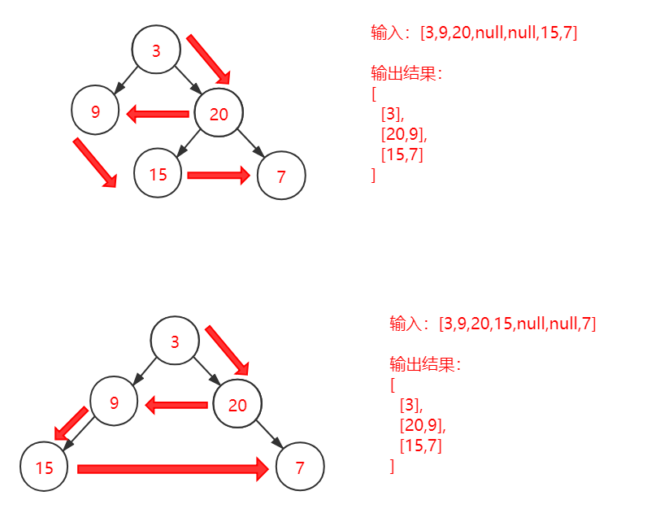

### 题目要求

1. 返回其节点值的锯齿形层序遍历（也就是，如果第一层遍历顺序时从左到右，第二次遍历顺序就要从右到左，依次类推）

### 图解示例



### 算法思想

方法一：使用广度优先搜索 + 调整结果

1. 本题比较简单的办法就是先使用广度优先搜索，即遍历到哪一层，都按从左到右的顺序放入列表中
2. 完成遍历后，对偶数层（即下标为单数的ans[i]）的遍历结果，倒转顺序

方法二：使用栈+列表

1. 通过分析示例，我们发现，偶数层的遍历顺序与输出顺序刚好相反，即本来先遍历到的数据，后出现在列表中
2. 使用栈（先进后出）的方式存储偶数层节点数据，当换到下一层的时候，依次 `pop` 出栈中的数据，放到分步

### 完整代码

方法一：使用广度优先搜索 + 调整结果

```c++
class Solution {
public:
    vector<vector<int> > zigzagLevelOrder(TreeNode* root) {
        vector<vector<int> > ans;
        if(root==NULL) return ans;
        // 分步结果 
        vector<int> temp;
        // 层数标记 
        int flag_layer = 1;
        // 广度优先搜索 
        queue<pair<TreeNode*, int> > q;
        q.push(make_pair(root,1));
        while(!q.empty()) {
        	pair<TreeNode*, int> p = q.front();
        	q.pop();
        	// 记录节点和层数
        	TreeNode* node = p.first;
        	int layer = p.second;
        	// 下一层时，需要将分步结果temp中的数据放入ans中，并重置分步结果temp，用来存储新一层的数据
        	if(layer!=flag_layer) {
        		ans.push_back(temp);
        		temp.clear();
        		flag_layer = layer;
			}
        	temp.push_back(node->val);
            // 继续广度遍历
        	if(node->left) {
        		q.push(make_pair(node->left,layer + 1));
			}
			if(node->right) {
				q.push(make_pair(node->right,layer+1));
			}
			int size = q.size();
		}
        // 最后一层的分步结果加入ans
		ans.push_back(temp);
        // 将下标为奇数的ans中的对应表列表中的数据倒转
		for(int i = 1; i < ans.size(); i+=2) {
			int len =  ans[i].size();
			for(int j = 0; j < len/2; j++) {
				int temp = ans[i][j];
				ans[i][j] = ans[i][len-1-j];
				ans[i][len-1-j] = temp;
			}
		}
		return ans;
    }
};
```

方法二：使用栈+列表

```c++
class Solution {
public:
    vector<vector<int> > zigzagLevelOrder(TreeNode* root) {
        vector<vector<int> > ans;
        if(root==NULL) return ans;
        // 分步结果 
        vector<int> temp;
        // 记录偶数层数据
        stack<int> even_stack;
        // 广度优先搜索 
        queue<pair<TreeNode*, int> > q;
        //标记层数 
        int layer_flag = 1;
        q.push(make_pair(root,1));
        while(!q.empty()) {
        	pair<TreeNode*, int> p = q.front();
        	q.pop();
        	TreeNode* node = p.first;
        	int layer = p.second;
            // 下一层时，需要将分步结果temp/even_stack中的数据放入ans中，并重置分步结果temp/even_stack，
            // 用来存储新一层的数据
        	if(layer!=layer_flag) {
        		while(!even_stack.empty()) {
        			temp.push_back(even_stack.top());
        			even_stack.pop();
				} 
        		ans.push_back(temp);
        		temp.clear();
        		layer_flag = layer; 
			}
			// 判断当前层需要用到哪一种数据结构存储 
			if(layer%2==0) {
        		even_stack.push(node->val);
			} else {
				temp.push_back(node->val);
			}
            // 继续广度遍历
        	if(node->left) {
        		q.push(make_pair(node->left,layer + 1));
			}
			if(node->right) {
				q.push(make_pair(node->right,layer+1));
			}
			
		}
        // 最后一层的分步结果加入ans
		if(layer_flag%2==0) {
			while(!even_stack.empty()) {
    			temp.push_back(even_stack.top());
    			even_stack.pop();
			} 
			ans.push_back(temp);
		} else{
			ans.push_back(temp);
		}
		return ans;
    }
};
```

### 设计分析

方法一：

时间复杂度：O(n+(logn)^2^/2)~o(n)：n是指遍历整棵树，logn/2是指层数，logn指层数中的size

空间复杂度：O(2logn)~o(logn)需要一个队列，和分步结果队列

方法二：

时间复杂度：O(nlogn/2)：n是指遍历整棵树，logn/2是指需要使用栈的层数

空间复杂度：O(3logn)~o(logn)：需要一个队列，和分步结果队列，一个栈

### 提交结果

