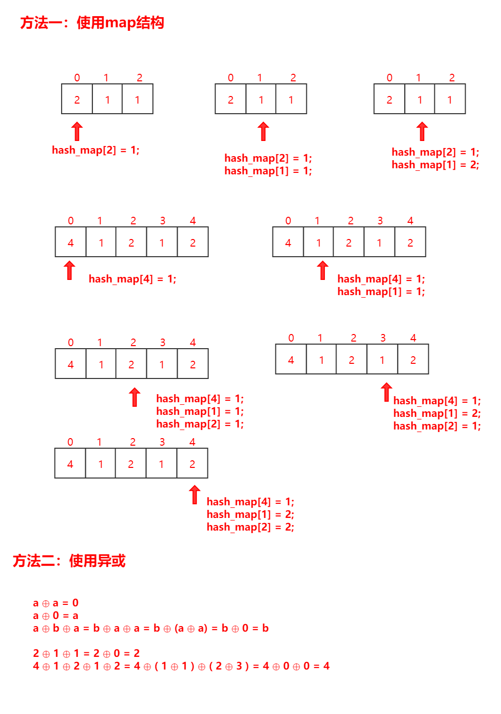

### 题目要求

1. 给定一个**非空**整数数组，除了==某个元素只出现一次==以外，==其余每个元素均出现两次==。

### 图解示例



### 算法思想

方法一：使用map记录的方式

1. 遍历整个列表，如果key存在，对应的value为2；如果key不存在，对应的value为1
2. 遍历整个map，然后得到value为1的key就是结果

方法二：使用异或的方法

异或有如下计算法则：

1. a ⊕ a = 0（任何一个值异或自己等于0）
2. a ⊕ 0 = a（任何一个值异或0等于它本身）
3. a ⊕ b ⊕ a = b ⊕ a ⊕ a = b ⊕ (a ⊕ a) = b ⊕ 0 = b（异或与加法交换律类似）
4. 于是就有上述图解了

### 完整代码

方法一：

```c++
class Solution {
public:
    int singleNumber(vector<int>& nums) {
		map<int,int> hash_map;
		for(int i = 0; i < nums.size(); i++) {
			if(hash_map.find(nums[i])!=hash_map.end()) {
				hash_map[nums[i]] = 2;
			} else {
				hash_map[nums[i]] = 1;
			}
		}
		map<int,int>::iterator it;
		for(it = hash_map.begin(); it != hash_map.end(); it++) {
			if(it->second==1) return it->first;
		}
		return 0;
    }
};
```

方法二：

```c++
class Solution {
public:
    int singleNumber(vector<int>& nums) {
        int ans = 0;
        for (auto e: nums) ans ^= e;
        return ans;
    }
};
```

(PS：看到这个解法，我当时就笑了)

### 设计分析

方法一：

时间复杂度：O(3n/2)~O(n)

空间复杂度：O(n/2)~O(n)

方法二：

时间复杂度：O(n)

空间复杂度：O(1)

### 提交结果

方法一：


方法二：


==若有其他解法，欢迎评论区补充。==